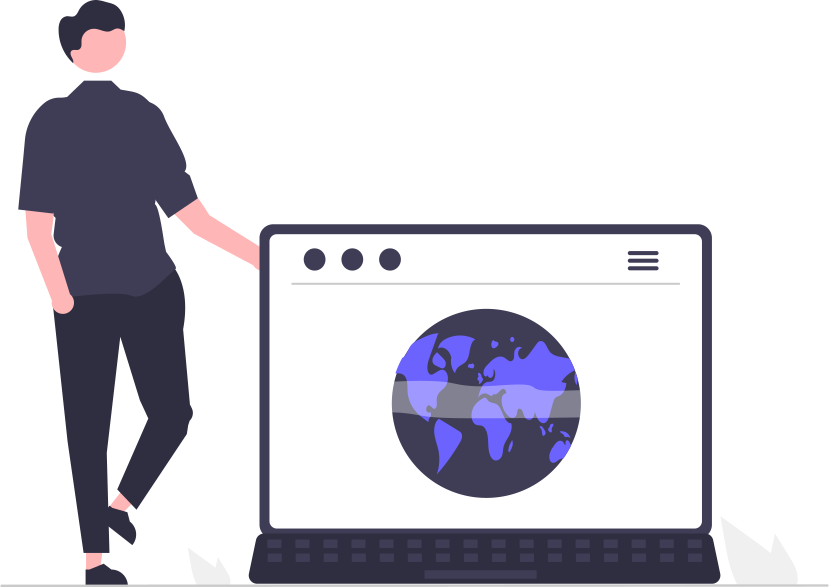

# Hi there 👋 I'm Özkan

- 🔭 I’m currently working on ...
- 🌱 I’m currently learning ...
- 👯 I’m looking to collaborate on ...
- 🤔 I’m looking for help with ...
- 💬 Ask me about ...
- 📫 How to reach me: ...
- 😄 Pronouns: ...
- ⚡ Fun fact: ...

## My Skils 🛠️:

Adobe Creative Cloud Apps; Photoshop, Illustrator and Dreamveawer | 3D; Cinema4D (Digital Skills - Visual),
cPanel, HTML; CSS and PHP; phpmyadmin (Digital Skills - Web), Dart; Flutter and Android Studio (Digital Skills - Mobile),
CRM; Hubspot | Mail//Bulletin Marketing Tools; MailChimp, Sendinblue | Google Analytics, Admob | Semrush (Digital
Skills - Marketing),
Business Development | Business-to-Business (B2B) | Pricing Marketing and Business Strategy (Industry Knowledge),
Project Management | Six Sigma | Kaizen | LEED and Sustainability | HUMINT (Industry Knowledge),
Threat Identification, Investigations and Relationship Building | Analytical Thinking and Teamwork (Interpersonal Skills)

### Find me around the web 🌎:

 

- <code></code>: <a href="https://twitter.com/ozkanozdurmus">@ozkanozdurmus</a>
- <code></code>: <a href="https://www.linkedin.com/in/aliozkanozdurmus/">@aliozkanozdurmus</a>
- <code></code>: <a href="https://aliozkanozdurmus.medium.com/">@aliozkanozdurmus</a>

